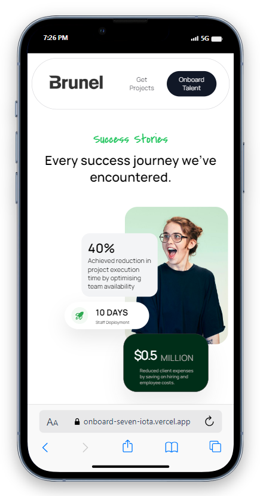
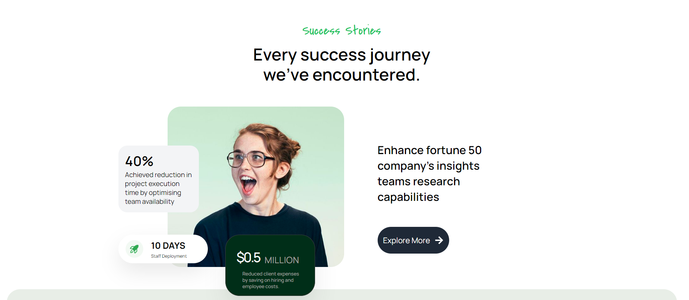

# Onboarding (Landing page)


To document the local setup process for running the app using the npm package manager, along with highlighting the app's features such as visually appealing design, responsiveness, hover animations, and the use of React Router DOM for dynamic routing, you can follow the structure below. This example assumes you're using a README.md file for documentation:

---

## Snaps of the website

Mobile view

PC view (Desktop)

## Local Setup

To run the app locally, you need to have Node.js and npm installed on your machine. If you haven't installed them yet, you can download and install Node.js (which comes with npm) from [Node.js official website](https://nodejs.org/).

Once you have Node.js and npm installed, follow these steps to set up and run the app:

1. **Clone the Repository**

   First, clone the repository to your local machine using Git. If you don't have Git installed, you can download it from [Git official website](https://git-scm.com/downloads).

   ```bash
   git clone https://github.com/your-repository-url.git
   cd your-repository-name
   ```

2. **Install Dependencies**

   Navigate to the project directory and install the required npm packages.

   ```bash
   npm install
   ```

3. **Start the Development Server**

   Run the following command to start the development server. This will compile your app and start the development server.

   ```bash
   npm start
   ```

   After starting the server, open your web browser and navigate to [http://localhost:3000](http://localhost:3000) to view the app.

## App Features

- **Visually Appealing, Responsive Design**: The app is designed with a focus on aesthetics and usability. It provides a visually appealing experience across various devices and screen sizes, ensuring a consistent and enjoyable user experience.

- **Great UX and UI**: The user interface is intuitive and user-friendly, making navigation and interaction seamless. The design principles ensure that the app is not only beautiful but also easy to use.

- **Hover Animations and Effects**: Enhance the interactivity of the app with smooth hover animations and effects. These subtle animations add a layer of polish and make the app feel more dynamic and engaging.

- **Dynamic Routing with React Router DOM**: The app leverages React Router DOM for dynamic routing, enabling the creation of single-page applications (SPAs). This means that navigating between different parts of the app doesn't require a full page reload, significantly improving performance and providing a smoother user experience.

By following these steps, you'll be able to set up and run the app locally on your machine. Enjoy exploring the app's features and its dynamic, responsive design


